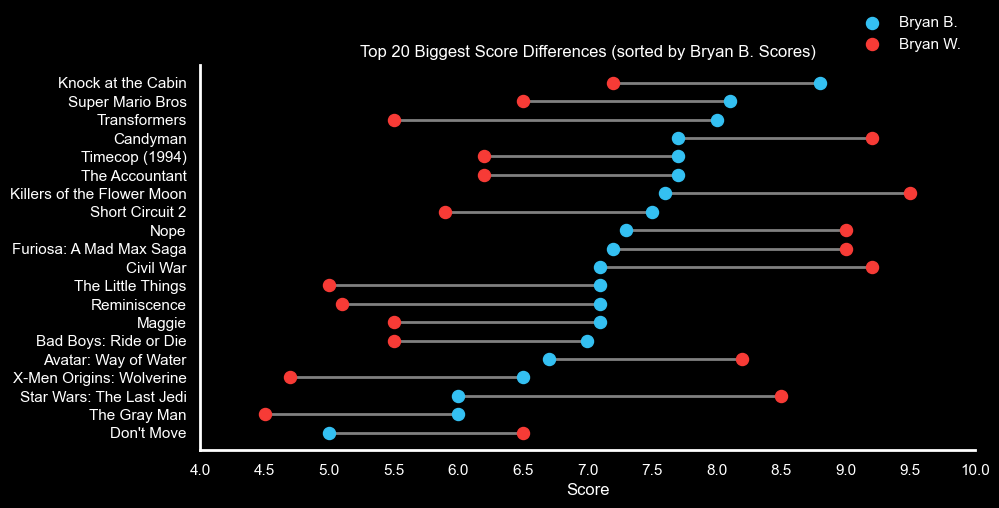
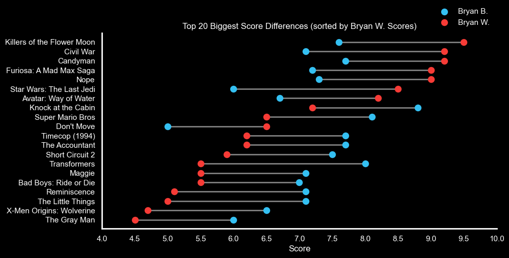

# Introduction
This project looked at movie score data from the Bryan vs Bryan podcast.  I decided to collect and analyze the data for movies being reviewed.

 [!NOTE] Not all of the podcast episodes are for movies.  This dataset is for the movie episodes only.

 # Data Update
 I'll try to update the dataset when a new episode is released.

# Background
The motivation behind this project was that I wanted to understand and visualize the movie score data for each host. I was also curious as to how they would compare or differ across various variables (e.g., budget or length)

The questions that I was really interested in were:

1. Which movies are the highest/lowest rated (cumulative score)?
2. Which host consistently rates movies higher than the other?
3. How do each host's scores differ?
4. How does genre, budget, MPA rating, and length impact the score?
5. Which movies do the two hosts agree/disagree the most?
6. Which movies spent the most/least per score point?

# Analysis
Bryan Vs Bryan has reviewed 184 movies (as of 7/7/2024).

- Bryan B's average score: 7.15
- Bryan W's average score: 7.05
- The total scores given for all movies: 2,569.85
- The average cumulative score for all movies: 14.20
- The median cumulative score for all movies: 14.20
- The maximum cumulative score for all movies: 20.00 for Django Unchained and The Blair Witch Project
- The minimum cumulative score for all movies: 6.70 for Tom and Jerry

The action genre is the most popular, followed by horror and comedy.

With respect to the MPA Rating, the most common rating is "R".

## Which movies are the highest/lowest rated (cumulative score)?

### Top 10 Movies (Highest Cumulative Score)

| Episode | Title                  | Bryan_B_Score | Bryan_W_Score | Cumulative_Score | Budget       | Budget_Per_Point |
|---------|------------------------|---------------|---------------|------------------|--------------|------------------|
| 148     | Django Unchained       | 10.00         | 10.00         | 20.00            | $100,000,000 | $5,000,000       |
| 10      | The Blair Witch Project| 10.00         | 10.00         | 20.00            | $60,000      | $3,000           |
| 63      | The Shining            | 9.60          | 9.70          | 19.30            | $19,000,000  | $984,456         |
| 72      | Spider Man 2           | 9.40          | 9.60          | 19.00            | $200,000,000 | $10,526,316      |
| 126     | The Departed           | 9.30          | 9.60          | 18.90            | $90,000,000  | $4,761,905       |
| 83      | The Dark Night         | 9.30          | 9.30          | 18.60            | $185,000,000 | $9,946,237       |
| 83      | The Batman             | 8.90          | 9.50          | 18.40            | $185,000,000 | $10,054,348      |
| 94      | Top Gun: Maverick      | 9.00          | 9.40          | 18.40            | $170,000,000 | $9,239,130       |
| 59      | Batman                 | 9.00          | 9.00          | 18.00            | $35,000,000  | $1,944,444       |
| 12      | Ghostbusters           | 9.00          | 9.00          | 18.00            | $30,000,000  | $1,666,667       |

### Biggest Flops (Lowest Cumulative Score)
| Episode | Title                    | Bryan_B_Score | Bryan_W_Score | Cumulative_Score | Budget       | Budget_Per_Point |
|---------|--------------------------|---------------|---------------|------------------|--------------|------------------|
| 30      | Tom and Jerry            | 3.70          | 3.00          | 6.70             | $79,000,000  | $11,791,045      |
| 189     | Mac and Me               | 3.20          | 3.70          | 6.90             | $13,000,000  | $1,884,058       |
| 141     | Blonde                   | 4.00          | 4.50          | 8.50             | $22,000,000  | $2,588,235       |
| 181     | Cyborg                   | 4.70          | 4.20          | 8.90             | $500,000     | $56,180          |
| 98      | Morbius                  | 4.40          | 4.50          | 8.90             | $75,000,000  | $8,426,966       |
| 73      | The Matrix Resurrections | 4.40          | 4.50          | 8.90             | $190,000,000 | $21,348,315      |
| 185     | Troll 2                  | 5.00          | 4.00          | 9.00             | $100,000     | $11,111          |
| 166     | Jason Goes to Hell       | 5.00          | 4.50          | 9.50             | $3,000,000   | $315,789         |
| 10      | Blair Witch              | 5.00          | 4.50          | 9.50             | $5,000,000   | $526,316         |
| 78      | The Lawnmower Man        | 4.20          | 5.50          | 9.70             | $10,000,000  | $1,030,928       |

## Which host consistently rates movies higher than the other?
Bryan B. seems to give movies higher scores with lower variation.

## How do each host's scores differ?
This carries into the score distributions by movie genre.

## Which movies do the two hosts agree/disagree the most?

## Which movies do the two hosts agree/disagree the most?

Update...

Update...

## Which movies spent the most/least per score point?
I was really interested in how much movies spend per point.  Spending less per point means that a movie is utilizing its budget efficiently.  Ideally, a movie has a low budget and a high score.  Worst case scenarios is spending a lot of money and receiving a low score.  The following tables provide insight into the moves that spent the most and the least per point.

### Top 10 Highest Spent Per Point

| Episode | Title                           | Bryan_B_Score | Bryan_W_Score | Cumulative_Score | Budget       | Budget_Per_Point       |
|---------|---------------------------------|---------------|---------------|------------------|--------------|------------------------|
| 124     | Avatar: Way of Water            | 6.70          | 8.20          | 14.90            | $350,000,000 | $23,489,932.89         |
| 8       | Star Wars: The Last Jedi        | 6.00          | 8.50          | 14.50            | $317,000,000 | $21,862,068.97         |
| 73      | The Matrix Resurrections        | 4.40          | 4.50          | 8.90             | $190,000,000 | $21,348,314.61         |
| 33      | Justice League Snyder Cut       | 7.50          | 7.00          | 14.50            | $300,000,000 | $20,689,655.17         |
| 111     | Thor: Love and Thunder          | 6.50          | 6.00          | 12.50            | $250,000,000 | $20,000,000.00         |
| 104     | The Gray Man                    | 6.00          | 4.50          | 10.50            | $200,000,000 | $19,047,619.05         |
| 188     | Aquaman and the Lost Kingdom    | 5.50          | 5.60          | 11.10            | $205,000,000 | $18,468,468.47         |
| 119     | Black Panther: Wakanda Forever  | 6.80          | 6.80          | 13.60            | $250,000,000 | $18,382,352.94         |
| 154     | Mission Impossible: Dead Reckoning| 7.90        | 8.90          | 16.80            | $291,000,000 | $17,321,428.57         |
| 184     | The Marvels                     | 6.00          | 7.10          | 13.10            | $220,000,000 | $16,793,893.13         |

### Top 10 Lowest Spend Per Point
| Episode | Title                  | Bryan_B_Score | Bryan_W_Score | Cumulative_Score | Budget     | Budget_Per_Point |
|---------|------------------------|---------------|---------------|------------------|------------|------------------|
| 10      | The Blair Witch Project| 10.00         | 10.00         | 20.00            | $60,000    | $3,000.00        |
| 185     | Troll 2                | 5.00          | 4.00          | 9.00             | $100,000   | $11,111.11       |
| 181     | Cyborg                 | 4.70          | 4.20          | 8.90             | $500,000   | $56,179.78       |
| 169     | X                      | 7.40          | 8.50          | 15.90            | $1,000,000 | $62,893.08       |
| 90      | The Raid: Redemption   | 6.20          | 7.00          | 13.20            | $1,100,000 | $83,333.33       |
| 167     | Talk to Me             | 8.60          | 9.10          | 17.70            | $4,500,000 | $254,237.29      |
| 103     | Get Out                | 8.80          | 8.50          | 17.30            | $4,500,000 | $260,115.61      |
| 166     | Jason Goes to Hell     | 5.00          | 4.50          | 9.50             | $3,000,000 | $315,789.47      |
| 107     | Maggie                 | 7.10          | 5.50          | 12.60            | $4,000,000 | $317,460.32      |
| 186     | The Visit              | 7.40          | 7.20          | 14.60            | $5,000,000 | $342,465.75      |

# Conclusion

## Bryan B's Top 10 Movies

## Bryan W's Top 10 Movies