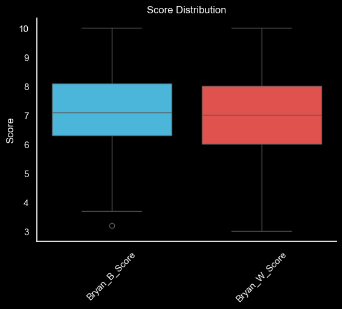
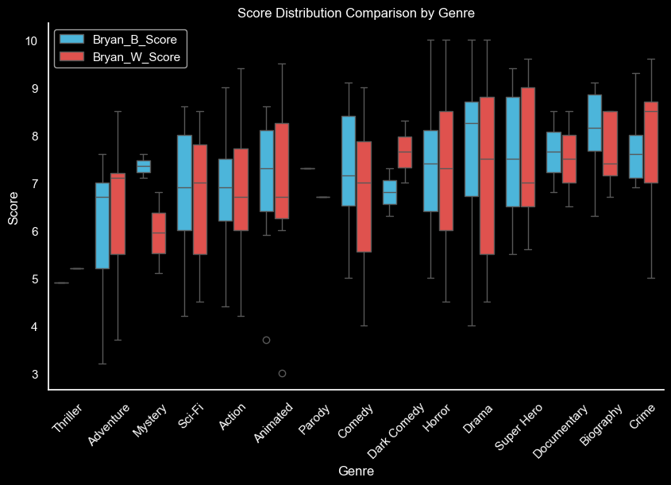

# Introduction
This project looked to visualize movie data from the Bryan vs Bryan podcast.  I wanted to understand how each host scored movies. I decided to collect and analyze their scores along with the metadata for the movies being reviewed.

A big thanks to Bryan B. for giving me permission to publish this work.

>[!NOTE]
Not all of the podcast episodes are for movies.  This dataset is for the movie episodes only.

 # Data Updates
 I'll try to update the dataset when a new episode is released.

# Background
The motivation behind this project was that I wanted to understand and visualize the movie score data for each host. I was also curious as to how they would compare or differ across various variables (e.g., budget, movie length, etc.)

The questions that I was really interested in were:

1. Which movies are the highest/lowest rated (cumulative score)?
2. How do each host's scores compare/differ?
    - Does one host tend to rate things higher?
3. How does genre, budget, MPA rating, and length impact the score?
4. Which movies do the two hosts agree/disagree the most?
5. Which movies spent the most/least per score point?

# Analysis
Bryan Vs Bryan has reviewed 184 movies (as of 7/7/2024).

- Bryan B's average score: 7.15
- Bryan W's average score: 7.05
- The total scores given for all movies: 2,569.85
- The average cumulative score for all movies: 14.20
- The median cumulative score for all movies: 14.20
- The maximum cumulative score for all movies: 20.00 for Django Unchained and The Blair Witch Project
- The minimum cumulative score for all movies: 6.70 for Tom and Jerry

The action genre is the most popular, followed by horror and comedy.

Digging further into the genre, including the sub-genre, we see that Horror-Thriller was the most reviewed sub-genre.

With respect to the MPA Rating, the most common rating is "R".

## Which movies are the highest/lowest rated (cumulative score)?
I was really curious to see how the host's views of movies align with my own.  Which movies did they love and which did they really dislike?  The Top 10 movies (below) provide in glimpse at which movies both hosts loved.

### Top 10 Movies (Highest Cumulative Score)
| Episode | Title                  | Bryan_B_Score | Bryan_W_Score | Cumulative_Score | Budget       | Budget_Per_Point |
|---------|------------------------|---------------|---------------|------------------|--------------|------------------|
| 148     | Django Unchained       | 10.00         | 10.00         | 20.00            | $100,000,000 | $5,000,000       |
| 10      | The Blair Witch Project| 10.00         | 10.00         | 20.00            | $60,000      | $3,000           |
| 63      | The Shining            | 9.60          | 9.70          | 19.30            | $19,000,000  | $984,456         |
| 72      | Spider Man 2           | 9.40          | 9.60          | 19.00            | $200,000,000 | $10,526,316      |
| 126     | The Departed           | 9.30          | 9.60          | 18.90            | $90,000,000  | $4,761,905       |
| 83      | The Dark Night         | 9.30          | 9.30          | 18.60            | $185,000,000 | $9,946,237       |
| 83      | The Batman             | 8.90          | 9.50          | 18.40            | $185,000,000 | $10,054,348      |
| 94      | Top Gun: Maverick      | 9.00          | 9.40          | 18.40            | $170,000,000 | $9,239,130       |
| 59      | Batman                 | 9.00          | 9.00          | 18.00            | $35,000,000  | $1,944,444       |
| 12      | Ghostbusters           | 9.00          | 9.00          | 18.00            | $30,000,000  | $1,666,667       |

### Top 10 Flops (Lowest Cumulative Score)
I also wanted to see which movies were the worst rated.  The Top 10 Flops show which movies recieved the lowest cumulative scores.

| Episode | Title                    | Bryan_B_Score | Bryan_W_Score | Cumulative_Score | Budget       | Budget_Per_Point |
|---------|--------------------------|---------------|---------------|------------------|--------------|------------------|
| 30      | Tom and Jerry            | 3.70          | 3.00          | 6.70             | $79,000,000  | $11,791,045      |
| 189     | Mac and Me               | 3.20          | 3.70          | 6.90             | $13,000,000  | $1,884,058       |
| 141     | Blonde                   | 4.00          | 4.50          | 8.50             | $22,000,000  | $2,588,235       |
| 181     | Cyborg                   | 4.70          | 4.20          | 8.90             | $500,000     | $56,180          |
| 98      | Morbius                  | 4.40          | 4.50          | 8.90             | $75,000,000  | $8,426,966       |
| 73      | The Matrix Resurrections | 4.40          | 4.50          | 8.90             | $190,000,000 | $21,348,315      |
| 185     | Troll 2                  | 5.00          | 4.00          | 9.00             | $100,000     | $11,111          |
| 166     | Jason Goes to Hell       | 5.00          | 4.50          | 9.50             | $3,000,000   | $315,789         |
| 10      | Blair Witch              | 5.00          | 4.50          | 9.50             | $5,000,000   | $526,316         |
| 78      | The Lawnmower Man        | 4.20          | 5.50          | 9.70             | $10,000,000  | $1,030,928       |

## Which host consistently rates movies higher than the other?
Bryan B. seems to give movies slightly higher scores with lower variation.  However, the hosts tend to agree more often than not.

## How do each host's scores differ?
This carries into the score distributions by movie genre.  Brian B. showing a slight edge in mean score across most genres.  Bryan W. tends to have a broader range of scores across genres.

The distribution below provides insight into how the score are distributed for each host.  The skew for both hosts is slightly negative meaning that the distribution of the scores is skewed to the left.  This means that a majority of the reviews are positive.  The also both have negative kurtosis values (platykurtosis) which indicates that the scores are more evently distributed around the mean with fewer extremely high or low scores.

 - Bryan B's Distribution:
     - Skew: -0.417
    - Kurtosis: -0.038
 - Bryan W's Distribution:
    - Skew: -0.136
    - Kurtosis: -0.538

## Which movies do the two hosts agree/disagree the most?
The visuals below shows where the two hosts disagree the most.  This visual is sorted by Bryan B.'s scores from highest to lowest where the two hosts disagree.  This highlights the differences in how each host viewed these movies because it wasn't always the same host scoring the movie higher.

The visual below is sorted by Bryan W.'s scores from highest to lowest where the two hosts differ the most.

## Which decade do the hosts like the most/least?
As a movie fan, there are special decades for movies.  Do the hosts prefer one decade over another?

The chart below provides another way to view the scores by decade.  We can see that the 2000s appear to have a higher average score while the 1990s and 2010s have the highest rated movie(s).

In addition, are the specific years that produced better or worse movies?  Keep in mind, most of the movies reviewed are current theatrical releases.

## Which movies spent the most/least per score point?
I was really interested in how much movies spend per point.  Spending less per point means that a movie is utilizing its budget efficiently.  Ideally, a movie has a low budget and a high score.  The worst case scenarios is spending a lot of money and receiving a low score.  The following tables provide insight into the movies that spent the most and the least per point.

### Top 10 Highest Spent Per Point
The table below outlines the movies that spent the most on each point in the cumulative score.
| Episode | Title                           | Bryan_B_Score | Bryan_W_Score | Cumulative_Score | Budget       | Budget_Per_Point       |
|---------|---------------------------------|---------------|---------------|------------------|--------------|------------------------|
| 124     | Avatar: Way of Water            | 6.70          | 8.20          | 14.90            | $350,000,000 | $23,489,932.89         |
| 8       | Star Wars: The Last Jedi        | 6.00          | 8.50          | 14.50            | $317,000,000 | $21,862,068.97         |
| 73      | The Matrix Resurrections        | 4.40          | 4.50          | 8.90             | $190,000,000 | $21,348,314.61         |
| 33      | Justice League Snyder Cut       | 7.50          | 7.00          | 14.50            | $300,000,000 | $20,689,655.17         |
| 111     | Thor: Love and Thunder          | 6.50          | 6.00          | 12.50            | $250,000,000 | $20,000,000.00         |
| 104     | The Gray Man                    | 6.00          | 4.50          | 10.50            | $200,000,000 | $19,047,619.05         |
| 188     | Aquaman and the Lost Kingdom    | 5.50          | 5.60          | 11.10            | $205,000,000 | $18,468,468.47         |
| 119     | Black Panther: Wakanda Forever  | 6.80          | 6.80          | 13.60            | $250,000,000 | $18,382,352.94         |
| 154     | Mission Impossible: Dead Reckoning| 7.90        | 8.90          | 16.80            | $291,000,000 | $17,321,428.57         |
| 184     | The Marvels                     | 6.00          | 7.10          | 13.10            | $220,000,000 | $16,793,893.13         |

### Top 10 Lowest Spend Per Point
The table below outlines the movies that spent the least on each point in the cumulative score.  These are the best "bang for your buck" movies.
| Episode | Title                  | Bryan_B_Score | Bryan_W_Score | Cumulative_Score | Budget     | Budget_Per_Point |
|---------|------------------------|---------------|---------------|------------------|------------|------------------|
| 10      | The Blair Witch Project| 10.00         | 10.00         | 20.00            | $60,000    | $3,000.00        |
| 185     | Troll 2                | 5.00          | 4.00          | 9.00             | $100,000   | $11,111.11       |
| 181     | Cyborg                 | 4.70          | 4.20          | 8.90             | $500,000   | $56,179.78       |
| 169     | X                      | 7.40          | 8.50          | 15.90            | $1,000,000 | $62,893.08       |
| 90      | The Raid: Redemption   | 6.20          | 7.00          | 13.20            | $1,100,000 | $83,333.33       |
| 167     | Talk to Me             | 8.60          | 9.10          | 17.70            | $4,500,000 | $254,237.29      |
| 103     | Get Out                | 8.80          | 8.50          | 17.30            | $4,500,000 | $260,115.61      |
| 166     | Jason Goes to Hell     | 5.00          | 4.50          | 9.50             | $3,000,000 | $315,789.47      |
| 107     | Maggie                 | 7.10          | 5.50          | 12.60            | $4,000,000 | $317,460.32      |
| 186     | The Visit              | 7.40          | 7.20          | 14.60            | $5,000,000 | $342,465.75      |

## Bryan B's Top 10 Movies
| Episode | Title                | Release Date | Budget     | Budget (Millions) | Rating | Genre    | Sub-Genre | Run Time Minutes | Bryan B Score | Bryan W Score | Score Difference | Notes                           | Decade | Cumulative Score | Budget Type | Specific Genre | Budget Per Point | Difference AV |
|---------|----------------------|--------------|------------|-------------------|--------|----------|-----------|------------------|---------------|---------------|-----------------|---------------------------------|--------|-----------------|-------------|----------------|------------------|---------------|
| 125     | Django Unchained     | 2012         | 100000000  | 100.00            | R      | Drama    | Western   | 165              | 10.00         | 10.00         | 0.00            | NaN                             | 2010   | 20.00           | Large       | Drama-Western  | 5000000.00       | 0.00          |
| 1       | The Blair Witch Project | 1999       | 60000      | 0.06              | R      | Horror   | Mystery   | 81               | 10.00         | 10.00         | 0.00            | NaN                             | 1990   | 20.00           | Micro       | Horror-Mystery | 3000.00          | 0.00          |
| 45      | The Shining          | 1980         | 19000000   | 19.00             | R      | Drama    | Horror    | 144              | 9.60          | 9.70          | -0.10           | NaN                             | 1980   | 19.30           | Medium      | Drama-Horror   | 984455.96        | 0.10          |
| 54      | Spider Man 2         | 2004         | 200000000  | 200.00            | PG-13  | Super Hero | NaN       | 127              | 9.40          | 9.60          | -0.20           | NaN                             | 2000   | 19.00           | Large       | NaN            | 10526315.79      | 0.20          |
| 66      | The Dark Night       | 2008         | 185000000  | 185.00            | PG-13  | Super Hero | NaN       | 152              | 9.30          | 9.30          | 0.00            | Mentioned in this episode       | 2000   | 18.60           | Large       | NaN            | 9946236.56       | 0.00          |
| 105     | The Departed         | 2006         | 90000000   | 90.00             | R      | Crime    | Thriller  | 151              | 9.30          | 9.60          | -0.30           | NaN                             | 2000   | 18.90           | Large       | Crime-Thriller | 4761904.76       | 0.30          |
| 137     | Training Day         | 2001         | 45000000   | 45.00             | R      | Crime    | Thriller  | 122              | 9.30          | 8.50          | 0.80            | NaN                             | 2000   | 17.80           | Medium      | Crime-Thriller | 2528089.89       | 0.80          |
| 96      | American Gangster    | 2007         | 100000000  | 100.00            | R      | Biography | Drama     | 157              | 9.10          | 8.50          | 0.60            | NaN                             | 2000   | 17.60           | Large       | Biography-Drama | 5681818.18       | 0.60          |
| 76      | Top Gun: Maverick    | 2022         | 170000000  | 170.00            | PG-13  | Action   | Drama     | 130              | 9.00          | 9.40          | -0.40           | NaN                             | 2020   | 18.40           | Large       | Action-Drama   | 9239130.43       | 0.40          |
| 41      | Batman               | 1989         | 35000000   | 35.00             | PG-13  | Super Hero | NaN       | 126              | 9.00          |

## Bryan B.'s Scores vs Budget Type
Does budget affect Bryan B.'s scores?

## Bryan W's Top 10 Movies
| Episode | Title                              | Release Date | Budget     | Budget (Millions) | Rating | Genre     | Sub-Genre | Run Time Minutes | Bryan B Score | Bryan W Score | Score Difference | Notes                           | Decade | Cumulative Score | Budget Type | Specific Genre    | Budget Per Point | Difference AV |
|---------|------------------------------------|--------------|------------|-------------------|--------|-----------|-----------|------------------|---------------|---------------|-----------------|---------------------------------|--------|-----------------|-------------|-------------------|------------------|---------------|
| 125     | Django Unchained                   | 2012         | 100000000  | 100.00            | R      | Drama     | Western   | 165              | 10.00         | 10.00         | 0.00            | NaN                             | 2010   | 20.00           | Large       | Drama-Western    | 5000000.00       | 0.00          |
| 1       | The Blair Witch Project            | 1999         | 60000      | 0.06              | R      | Horror    | Mystery   | 81               | 10.00         | 10.00         | 0.00            | NaN                             | 1990   | 20.00           | Micro       | Horror-Mystery   | 3000.00          | 0.00          |
| 45      | The Shining                        | 1980         | 19000000   | 19.00             | R      | Drama     | Horror    | 144              | 9.60          | 9.70          | -0.10           | NaN                             | 1980   | 19.30           | Medium      | Drama-Horror     | 984455.96        | 0.10          |
| 54      | Spider Man 2                       | 2004         | 200000000  | 200.00            | PG-13  | Super Hero | NaN       | 127              | 9.40          | 9.60          | -0.20           | NaN                             | 2000   | 19.00           | Large       | NaN              | 10526315.79      | 0.20          |
| 105     | The Departed                       | 2006         | 90000000   | 90.00             | R      | Crime     | Thriller  | 151              | 9.30          | 9.60          | -0.30           | NaN                             | 2000   | 18.90           | Large       | Crime-Thriller   | 4761904.76       | 0.30          |
| 146     | Killers of the Flower Moon          | 2023         | 200000000  | 200.00            | R      | Crime     | History   | 206              | 7.60          | 9.50          | -1.90           | NaN                             | 2020   | 17.10           | Large       | Crime-History    | 11695906.43      | 1.90          |
| 65      | The Batman                         | 2022         | 185000000  | 185.00            | PG-13  | Super Hero | NaN       | 176              | 8.90          | 9.50          | -0.60           | NaN                             | 2020   | 18.40           | Large       | NaN              | 10054347.83      | 0.60          |
| 143     | Spiderman: Across the Spiderverse   | 2023         | 150000000  | 150.00            | PG     | Animated  | Super Hero | 140              | 8.10          | 9.50          | -1.40           | NaN                             | 2020   | 17.60           | Large       | Animated-Super Hero | 8522727.27       | 1.40          |
| 76      | Top Gun: Maverick                  | 2022         | 170000000  | 170.00            | PG-13  | Action    | Drama     | 130              | 9.00          | 9.40          | -0.40           | NaN                             | 2020   | 18.40           | Large       | Action-Drama     | 9239130.43       | 0.40          |
| 66      | The Dark Night                     | 2008         | 185000000  | 185.00            | PG-13  | Super Hero | NaN       |

## Bryan W.'s Scores vs Budget Type
Does budget affect Bryan W.'s scores?

# Conclusion
This was a really fun and interesting project to tackle.  I enjoyed collecting the data, creating the visuals, and analyzing the outputs.  My goal was to understand how the hosts differ, how their scores align with my own "score" of the movie, and how various movie variables (e.g., budget) impacted the scores.

*Data Source: Bryan vs Bryan Podcast and [IMDB](https://www.imdb.com/)*